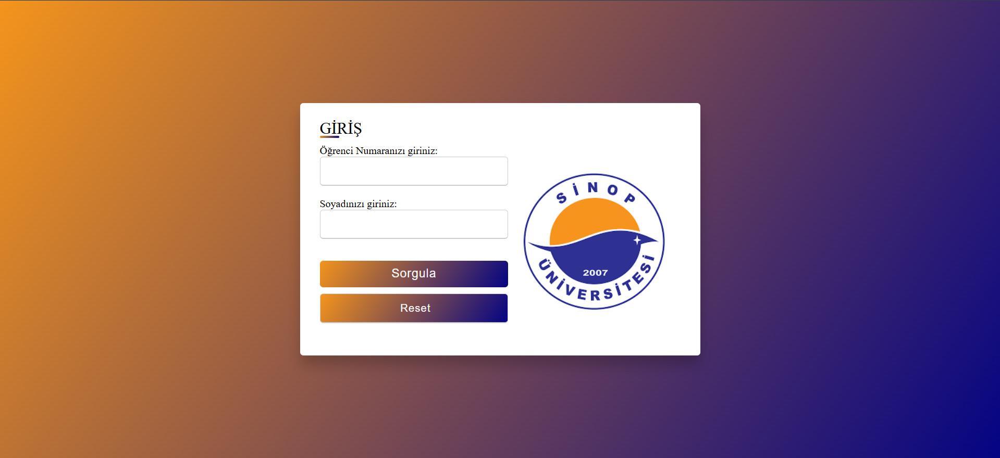
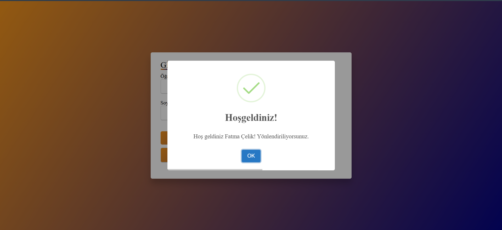
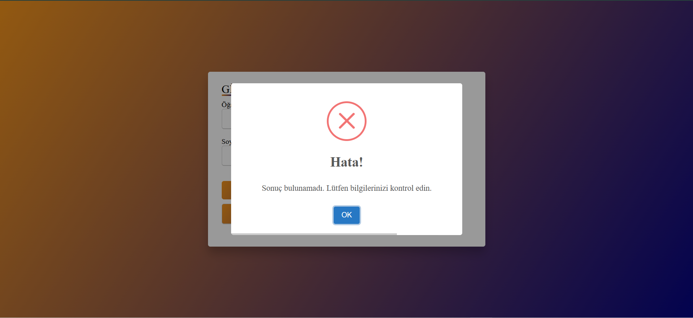
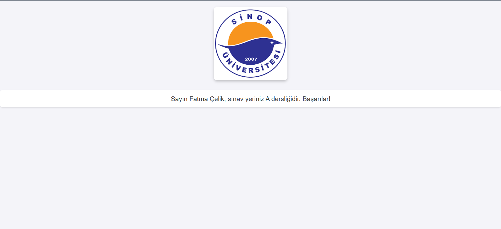

# Student Apopointment for Exam Classroom
The system, which places distance education students in the relevant classrooms for midterm and final exams according to the number of courses they take, is coded with html, css, javascript and php.
## Features
- Automated student-to-classroom assignment based on course load.
- Midterm and final exam scheduling.
- User-friendly interface for students.
- Secure database integration using PHP & MySQL.
- Responsive design with HTML, CSS, and JavaScript.
## Technologies Used
- HTML, CSS, JavaScript (Frontend)
- PHP (Backend)
- MySQL (Database)
## Usage
1. Students log in with their specified numbers and their surnames 
2. The system assigns students to classrooms based on how much courses they take.  or 
3. The assigned exam room is displayed on the new page which a student can print it. 
